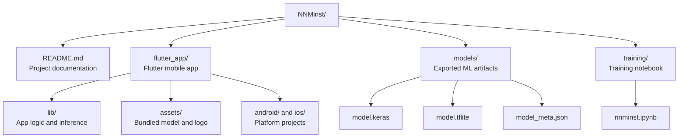
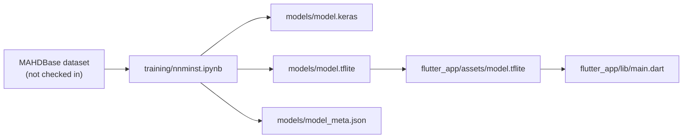

# NNMINST Digit Recognition

NNMINST is an end-to-end Arabic handwritten digit recognition project. It trains a
TensorFlow/Keras MLP classifier on the MAHDBase dataset, exports the model to
TensorFlow Lite, and runs inference inside a Flutter app for camera, gallery, and
drawing-canvas input.

Live demo: https://nnminst.netlify.app/

## Highlights

- Arabic handwritten digit recognition for classes `0-9`
- On-device inference with a bundled TensorFlow Lite model
- Camera, gallery, and drawing input modes
- Multi-digit prediction through classical image segmentation plus per-crop
  classification
- Output sequence with per-digit confidence details

## Reported model performance

Values below follow `NNMINST_Report_final.pdf` as the project source of truth.

| Item | Value |
| --- | --- |
| Dataset | MAHDBase, 60,000 BMP images |
| Classes | 10 digits, `0-9` |
| Split | 48,000 train / 6,000 validation / 6,000 test |
| Model | `mahdbase_mlp_v2` |
| Input | `64 x 64 x 1` grayscale image |
| Validation accuracy | 99.15% |
| Test accuracy | 99.20% |
| Deployment artifact | `model.tflite`, about 4.9 MB |

## Tech stack

- Python, TensorFlow, and Keras for model training
- TensorFlow Lite for mobile deployment
- Flutter and Dart for the app
- `tflite_flutter` for on-device inference
- Dart `image` package for preprocessing and segmentation
- MAHDBase handwritten Arabic digit dataset

## Dataset and preprocessing

The training pipeline recursively scans the MAHDBase files for names matching
`digit[0-9].bmp`. Each image is decoded, converted from RGB to grayscale using
standard luminance, normalized to `float32` in the `[0.0, 1.0]` range, padded to
a square while preserving aspect ratio, and resized to `64 x 64`.

The polarity convention is preserved throughout training and inference: dark ink
on a white background.

## Model architecture

`mahdbase_mlp_v2` is a compact fully connected MLP designed for mobile CPU
inference:

1. Input: `64 x 64 x 1`
2. Flatten: 4,096 features
3. Dense blocks: 1024, 512, 256, and 128 units
4. Batch normalization and ReLU activation in hidden layers
5. Dropout tapered across the wider layers
6. Output: 10-way softmax for digit classes `0-9`

Training used sparse categorical cross-entropy with Adam. The report records
training stopping at epoch 15 after reaching the validation-accuracy target, with
early stopping and learning-rate reduction used to control overfitting.

## Flutter segmentation pipeline

The Flutter app uses the TFLite model as a single-digit classifier. Multi-digit
recognition is produced by the app's preprocessing and segmentation pipeline:

1. Decode the selected image and bake orientation.
2. Detect a paper region in camera mode when possible.
3. Extract luminance and run a global Otsu sanity check.
4. Apply adaptive local Otsu thresholding for uneven lighting.
5. Find connected components with BFS flood fill.
6. Merge and filter candidate digit boxes.
7. Expand each crop, resize to `64 x 64`, convert to a tensor, and run TFLite
   inference.

Drawing mode groups nearby strokes, rasterizes them into the same `64 x 64`
input format, and feeds the tensor directly into the model.

## Project structure

The repository is split into three main parts: the Flutter app, the exported
model files, and the training notebook.

```text
NNMinst/
|-- README.md
|-- flutter_app/
|   |-- lib/
|   |   |-- main.dart
|   |   |-- link_launcher.dart
|   |   |-- link_launcher_stub.dart
|   |   `-- link_launcher_web.dart
|   |-- assets/
|   |   |-- model.tflite
|   |   `-- logo.png
|   |-- test/
|   |   `-- widget_test.dart
|   |-- android/
|   |-- ios/
|   |-- pubspec.yaml
|   `-- analysis_options.yaml
|-- models/
|   |-- model.keras
|   |-- model.tflite
|   `-- model_meta.json
`-- training/
    `-- nnminst.ipynb
```

| Path | Purpose |
| --- | --- |
| `README.md` | Project overview, setup steps, model contract, and repo guide |
| `flutter_app/lib/main.dart` | Main Flutter app, UI, image preprocessing, segmentation, and TFLite inference |
| `flutter_app/lib/link_launcher*.dart` | Platform-specific link opening helpers for app links |
| `flutter_app/assets/model.tflite` | TFLite model bundled into the Flutter app at runtime |
| `flutter_app/assets/logo.png` | App logo asset |
| `flutter_app/test/widget_test.dart` | Flutter widget test entry point |
| `flutter_app/android/` | Android platform project generated by Flutter |
| `flutter_app/ios/` | iOS platform project generated by Flutter |
| `flutter_app/pubspec.yaml` | Flutter dependencies, SDK constraints, and asset declarations |
| `models/model.keras` | Full Keras model export for reuse or future training work |
| `models/model.tflite` | TensorFlow Lite deployment model exported from training |
| `models/model_meta.json` | Model metadata: input size, shape, labels, polarity, and normalization |
| `training/nnminst.ipynb` | Notebook used to load MAHDBase, train the model, evaluate it, and export artifacts |

Figure 1 shows the main folders at a glance.



Figure 2 shows how the training outputs connect to the deployed app.



## Quick start: Flutter app

Requirements:

- Flutter 3.7+ with Dart 3.7+

Run the app:

```bash
cd flutter_app
flutter pub get
flutter run
```

Build a release APK:

```bash
cd flutter_app
flutter build apk
```

## Dataset

The MAHDBase dataset is not included in this repository. Download it from the AUC
dataset page and extract it into `data/`:

- MAHDBase training set: https://datacenter.aucegypt.edu/shazeem/Files/MAHDBase_TrainingSet.rar
- MAHDBase testing set: https://datacenter.aucegypt.edu/shazeem/Files/MAHDBase_TestingSet.rar
- Dataset homepage: https://datacenter.aucegypt.edu/shazeem/

Expected layout:

```text
data/MAHDBase_TrainingSet/Part01/writer001_pass01_digit0.bmp
...
data/MAHDBase_TrainingSet/Part12/*.bmp
```

## Train and export

Install the Python dependencies:

```bash
python -m pip install tensorflow pillow matplotlib numpy scikit-learn
```

Run the notebook:

```text
training/nnminst.ipynb
```

The checked-in model artifacts are:

```text
models/model.keras
models/model.tflite
models/model_meta.json
```

If you retrain and export a new TFLite model, update the Flutter asset:

```powershell
copy models\model.tflite flutter_app\assets\model.tflite
```

## Model contract

- Input shape: `[1, 64, 64, 1]`
- Input type: `float32`
- Normalization: luminance in `[0.0, 1.0]`
- Polarity: dark ink on white background
- Output shape: `[1, 10]`
- Output meaning: softmax probabilities for digit classes `0-9`

## Notes and limitations

- The TFLite model classifies one digit at a time; multi-digit output comes from
  app-side detection, cropping, and sorting.
- Touching digits may be detected as one region, so spacing improves results.
- Photo quality matters. Strong shadows, oblique angles, or low contrast can
  reduce segmentation quality even when the classifier performs well on clean
  crops.

## License

No license has been specified yet.
